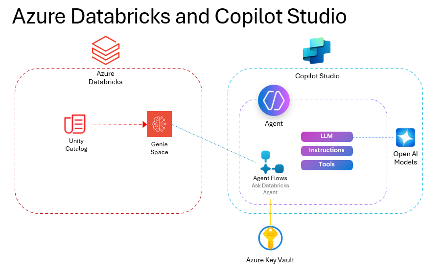

# CopilotGenieAgent

## Summary

This repository contains a Power Apps solution file that creates a Copilot Agent integrated with a Power Automate Agent Flow. The solution enables seamless connectivity to a Databricks Genie space, allowing users to interact with data and analytics through a conversational AI interface.

## Solution Components

The solution file in the src directory is based off of the [Copilot-and-Genie
](https://github.com/v7herman4/Copilot-and-Genie) repository posted by [Valter Herman](https://www.linkedin.com/in/valter-e-herman/) and [Melissa Lacefield](https://www.linkedin.com/in/melissa-lacefield-phd-2471116/).  They have documented many of the steps needed to import and configure the solution.

The key components of the solution file are the following:

| Name | Description |
|------|-------------|
| Databricks Genie Agent | This is the Copilot Studio Agent that we will use in the chat with your data scenario |
| Ask Databricks Genie | This is the Agent Flow that is embedded into the Databricks Genie Agent under Tools. It handles the communication with the Databricks Genie Space. |
| Azure Key Vault Connection | This is used within the Ask Databricks Genie agent flow to communicate with Azure Key Vault to retrieve the Tenant ID, Service Principal App ID, and Service Principal Client Secret. |
| Summarize JSON String | This AI Model is used within the Ask Databricks Genie agent flow. |
| Databricks Workspace URL | This is saved as an environmental value within Dataverse and is called in the Ask Databricks Genie agent flow. |
| Genie Space ID | This is saved as an environmental value within Dataverse and is called in the Ask Databricks Genie agent flow. |

NOTE:  Before you import the solution into PowerApps, you will need to create a Key Vault Connection and have it validated, otherwise the solution will fail during the import process.  Go to https://make.powerapps.com/ and click on Connections and click <B>+ New connection</b> to add the Key Vault Connection to your Power Apps environment beforehand.

This uses a Microsoft Entra Service Principal, you will need to add the Microsoft Entra Service Principal to Databricks and give it the following permissions in Databricks to Utilize the Genie Spaces.
•	Genie Space: 
    o	CAN USE 
•	SQL Warehouse: 
    o	CAN USE 
•	Unity Catalog: 
    o	USE CATALOG 
    o	USE SCHEMA 
    o	SELECT on tables/views

For more information on this topic, check out [Manage service principals](https://learn.microsoft.com/en-us/azure/databricks/admin/users-groups/manage-service-principals)

You will also need to add the Service Principal App ID, Service Principal Client Secret and Tenant ID as secrets to Azure Key Vault.  The user running this will need to the <B>Key Vault Secrets User</B> RBAC permission in Key Vault to utilize the Cloud Flow.
